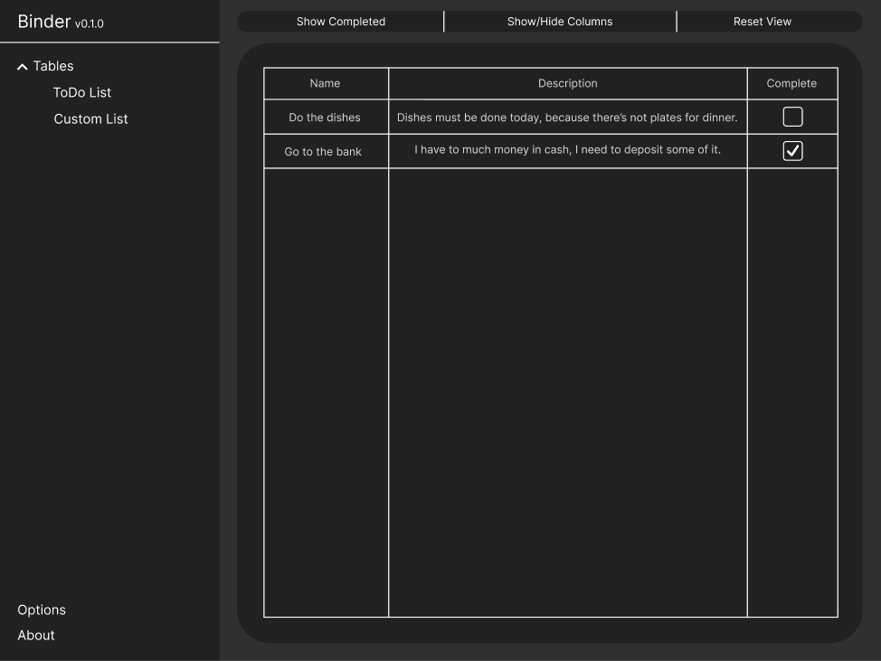

    

        
        <h1>Binder</h1>
        
Software-as-a-Service solution for <strong>task-oriented data management</strong>.

        
        
        
        
        
         
        Mockup:
         
        
    

## Table of Content

- [Tech Stack](#tech-stack)
- [Getting Started](#getting-started)
- [Licensing](#licensing)
- [Contact](#contact)

## Tech Stack

Main Parts:

- Angular v15.2.3
- ASP.NET Core Web API with .NET 6
- MySQL v10.4.27

Libraries:

- AutoMapper,
- FluentAssertion,
- FluentValidation,
- Moq,
- xUnit.net,
- Entity Framework Core,
- Transloco,
- Angular Material,

For current versions check:

- for frontend libraries: `package.json` file,
- for backend libraries: check out NuGet packages listing,

Tools:

- Husky + Prettier,
- OpenAPI Generator,
- CodeMaid (optional, per developer),

## Getting Started

If you would like to develop Binder with us, follow [project's setup instructions for development](https://github.com/Strayker-Software/Binder/wiki/Project-Setup).

> [!WARNING]
> This project is not ready for production deployment, license terms apply!

For production deployment:

- Download latest version of Binder from [Releases](https://github.com/Strayker-Software/Binder/releases) page,
- Setup and start MySQL server with Root user, no password and database, called `binder_db` with structure defined in Entity Framework Core migrations,
- (Optional) use `test-data.sql` file from `docs` folder to fill database with basic data,
- Start backend with `dotnet run` command, wait until loading completes,
- Push frontend's folder content to web server,
- Setup HTTP proxy with your own domains over frontend and (optionaly) backend endpoints (like Apapche, Nginx, etc.),
- Try to connect to frontend with web browser,

That's it, app should work now!

## Contributions

Feel free to contribute to project! Read [Contribution Guidelines](https://github.com/Strayker-Software/Binder/blob/develop/CONTRIBUTING.md) to discover how to do it!

## Licensing

This repository is licensed under [MIT/X11 License](https://github.com/Strayker-Software/Binder/blob/master/LICENSE).

Project's logo is not belonging to Strayker Software, here is copyrights addressing:

"<a target="_blank" rel="noopener noreferrer" href="https://www.flickr.com/photos/61927333@N00/5315135954">Retro Corporate Logo Goodness_00056</a>" by <a target="_blank" rel="noopener noreferrer" href="https://www.flickr.com/photos/61927333@N00">jordan_lloyd</a> is licensed under <a target="_blank" rel="noopener noreferrer" href="https://creativecommons.org/licenses/by/2.0/?ref=openverse">CC BY 2.0 </img></img></a>. 

## Contact

If you have any suggestions or you want to ask me for something, go to official [Strayker Software Discord Server!](https://discord.gg/ytdkCVD)
