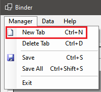
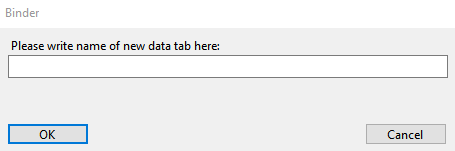
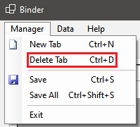
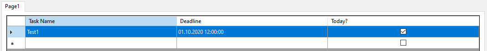

# Binder end user documentation

Last update: 05.10.2020 for version 0.1.0

If program's version has been changed and documentation wasn't updated, this means, that changes in app didn't require documentation update.

## Starting work with program

1. Download the newest stable version from GitHub repo: [Releases · Binder · GitHub](https://github.com/StraykerPL/Binder/releases). Make sure you are downloading the right package for your system,

2. Unzip program on generaly available computer's partition,

3. Create a shortcut to executable file on desktop, depending on choosen package "Binder.exe" or "Binder",

4. Run the program via shortcut and make sure, if the app's interface is displayed,

## Operating the program

1. How to add new tabpage with table to app?
   
   Using "Manager" menu click "New Tab":
   
   
   
   Like the picture shows, you can use CTRL+N shortcut.
   
   Binder will ask you to write new name for tabpage:
   
   
   
   After giving the name and accepting dialog box, new tabpage will appear in the interface:
   
   

2. How to delete a tabpage from program?
   
   Select the tabpage in the interface, you want to delete.
   
   Using "Manager" menu click "Delete Tab":
   
   
   
   Like the picture shows, you can use CTRL+N shortcut.
   
   *Warning: this operation is deleting the data base for given tabpage! That means, if there are any data in tabpage's table, this data will be deleted.*

3. How to save data quickly and effectively?
   
   "Manager" menu allows for to types of saving: saving active tabpage and saving all tabpages in the program, "Save" and "Save All" respectively:
   
   
   
   Using the first option will save the actively selected tabpage, secend will save all tabpages in the interface. You can use shown shortcuts too. 

4. How to add task to table?
   
   "Data" menu has option "Add Task" which adds new task to active tabpage's table. This option shows dialog box to gather data. After acceptance task will appear in tabpage's table. You can use shown shortcuts too.
   
   
   
   
   
   

5. How to edit existing task?
   
   "Data" menu has option "Edit Task" which allows to edit tasks. This option will show dialog box for actively selected task in active tabpage's table, load task's data and allow to change them. You can use shown shortcuts too.
   
   
   
   
   
   
   
   

6. How to delete task from table?
   
   "Data" menu has option "Delete Task" which allows to delete unneeded task. This option will delete actively selected task from tabpage's table. You can use shown shortcuts too.
   
   
   
   

## App's updates

In the closest time app's update will be fully manual files download, via [Releases · Binder · GitHub](https://github.com/StraykerPL/Binder/releases).
