# Binder End User Documentation

Last update: 07.07.2021 for version 0.2.0

If program's version has been changed and documentation wasn't updated, this means, that changes in app didn't require documentation update.

## Starting work with program

1. Download the newest stable version from GitHub repo: [Releases · Binder · GitHub](https://github.com/StraykerPL/Binder/releases),

2. Unzip program on generaly available computer's partition,

3. Create a shortcut to executable file "binder-(version)-x64.exe" on desktop,

4. Run the program via shortcut and make sure, if the app's interface will show up,

## Operating the program

1. How to add new category with table to app?
   
   Using "Manager" menu click "New Category":
   
   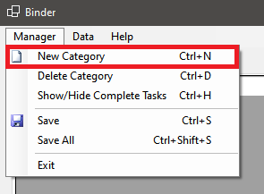
   
   Like the picture shows, you can use CTRL+N shortcut.
   
   Binder will ask you to write new name for category:
   
   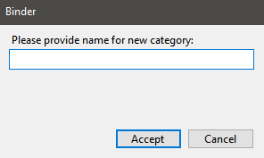
   
   After giving the name and accepting dialog box, new tabpage will appear in the interface:
   
   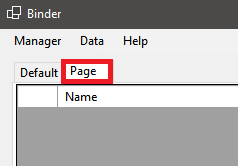

2. How to delete a category from program?
   
   Select the category in the interface, you want to delete.
   
   Using "Manager" menu click "Delete Category":
   
   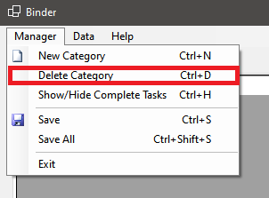
   
   Like the picture shows, you can use CTRL+D shortcut. In new dialog confirm, that you want to delete the category.
   
   *Warning: this operation is deleting tasks from deleted category too. This means that if there are any tasks, they will be deleted too.*

3. Managing default categories:
   
   By default, Binder has two categories built into client: "Default" category and "Completed" category. To the first category are coming tasks, that user didn't made a choice of exact category. To the second category are coming tasks from all available categories, tagged by user as finished. Both categories are undeletable from app. "Default" category is always shown in interface. To show "Completed" category, in "Manager" menu choose option "Show/Hide Complete Tasks":
   
   
   
   To once again hide "Completed" category, click this option again.

4. How to save data quickly and effectively?
   
   "Manager" menu allows for to types of saving (depending on settings): saving active category and saving all categories in the program, "Save" and "Save All" respectively:
   
   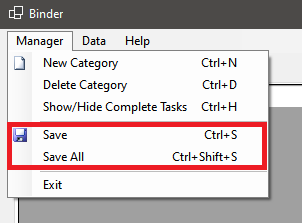
   
   Using the first option will save the actively selected category, secend will save all categories in the interface. You can use shown shortcuts too.
   
   For data file save setting, save of single category is unavailable because of saving liveness of user computer's storage devices.

5. How to add task to table?
   
   "Data" menu has option "Add Task" which adds new task to active tabpage's table. This option shows dialog box to gather data. To add task, name is enough, rest of data is optional. Binder will apply default settings, where it will need it, to add task to category properly. After acceptance task will appear in category's table. You can use shown shortcuts too.
   
   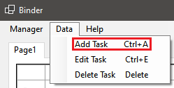
   
   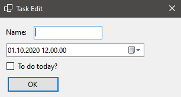
   
   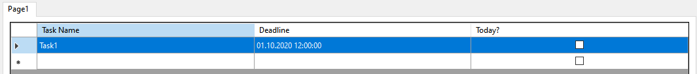

6. How to edit existing task?
   
   "Data" menu has option "Edit Task" which allows to edit tasks. This option will show dialog box for actively selected task in active category's table, load task's data and allow to change them. You can use shown shortcuts too.
   
   
   
   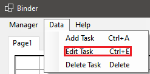
   
   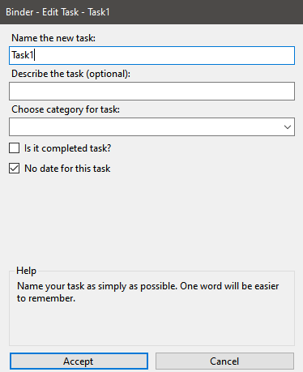
   
   After approving form, Binder will replace old data with new ones.

7. How to delete task from table?
   
   "Data" menu has option "Delete Task" which allows to delete unneeded tasks. This option will delete actively selected task from tabpage's table. You can use shown shortcuts too.
   
   
   
   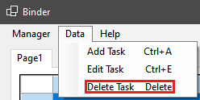
   
   *Warning: deleting task will not move it to "Completed"!*

## App's updates

In the closest time app's update will be fully manual files download, via [Releases · Binder · GitHub](https://github.com/StraykerPL/Binder/releases).
