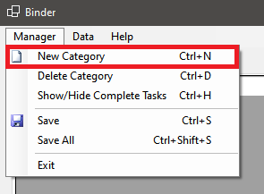
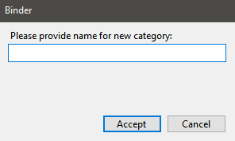
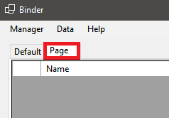
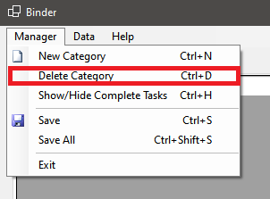
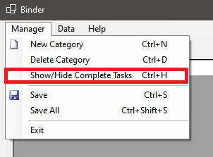
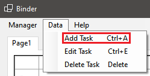
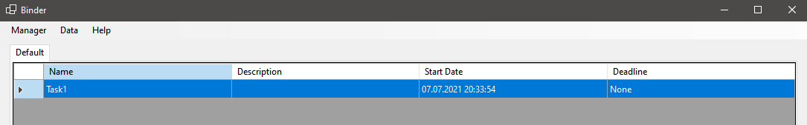
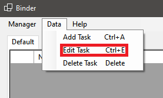
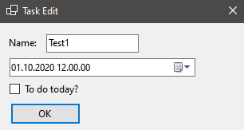
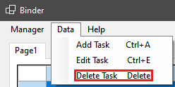

# Dokumentacja Użytkownika Końcowego Binder

Ostatnia aktualizacja: 07.07.2021 dla wersji 0.2.0

Jeśli wersja programu się zmieniła, a dokumentacja nie została zmieniona, oznacza to, że zmiany w programie nie wymagają aktualizacji dokumentacji.

## Rozpoczynanie pracy z programem

1. Pobierz najnowszą stabilną wersję z repozytorium na GitHub: [Releases · Binder · GitHub](https://github.com/StraykerPL/Binder/releases),

2. Rozpakuj program na ogólnodostępnej partycji komputera,

3. Utwórz skrót do pliku wykonywalnego "binder-(wersja)-x64.exe" na pulpicie,

4. Uruchom program poprzez skrót i upewnij się, że pojawi się interfejs programu,

## Obsługa programu

1. Jak dodać nową kategorię z tabelą zadań do programu?
   
   Przy pomocy menu "Manager" kliknij "New Category":
   
   
   
   Tak jak na zamieszczonym obrazku widneje, można też użyć skrótu CTRL+N.
   
   Binder poprosi Cię o podanie nazwy dla nowej kategorii:
   
   
   
   Po podaniu nazwy i zaakceptowaniu formularza, nowa kategoria pojawi się w interfejsie:
   
   

2. Jak usunąć kategorię z programu?
   
   Zaznacz w interfejsie kategorię, którą chcesz usunąć.
   
   Przy pomocy menu "Manager" kliknij "Delete Category":
   
   
   
   Tak jak na zamieszczonym obrazku widneje, można też użyć skrótu CTRL+D. Potwierdź w wyświetlonym komunikacie chęć usunięcia kategorii.
   
   *Uwaga: ta operacja usuwa także dane zadań kategorii! Oznacza to, że jeśli są jakieś zadania w tej kategorii, zostaną usunięte.*

3. Zarządzanie kategoriami domyślnymi:
   
   Domyślnie Binder posiada dwie kategorie wbudowane w klienta: kategoria "Domyślne" oraz kategoria "Ukończone". Do pierwszej kategorii trafiają zadania, którym użytkownik nie wybrał konkretnej kategorii. Do drugiej kategorii trafiają zadania z wszystkich możliwych kategorii, które zostały oznaczone przez użytkownika jako wykonane. Obie kategorie są nie usuwalne z programu. Kategoria "Domyślne" jest zawsze obecna w interfejsie. Aby wyświetlić kategorię "Ukończone"  w menu "Manager" wybierz opcję "Show/Hide Complete Tasks":
   
   
   
   Aby ponownie ukryć kategorię "Ukończone", ponownie kliknij tą opcję.

4. Jak zapisywać dane szybko i efektywnie?
   
   Menu "Manager" pozwala na dwa typy zapisu (w zależności od ustawień): zapis aktywnej kategorii i zapis wszystkich kategorii w programie, odpowiednio "Save" oraz "Save All":
   
   
   
   Użycie pierwszej opcji zapisze aktualnie wybraną w interfejsie kategorię, druga zapisze wszystkie kategorie obecne w interfejsie. Można użyć także pokazanych skrótów.
   
   Dla ustawienia zapisu do plików zapis aktywnej kategorii jest niedostępny ze względu na oszczędzanie żywotności nośników pamięci urzytkowników.

5. Jak dodać zadanie do tabeli?
   
   W menu "Data" opcja "Add Task" dodaje nowe zadanie do listy wybranej kategorii. Opcja otwiera okno dialogowe do podania danych. Aby dodać zadanie, wystarczy nazwa, reszta danych jest pocjonalna. Binder zastosuje domyślne ustawienia tam, gdzie będzie tego potrzebował, aby dodać prawidłowo zadanie do kategorii. Po akceptacji formularza zadanie pojawia się na liście. Można użyć także pokazanych skrótów.
   
   
   
   
   
   

6. Jak edytować istniejące zadanie?
   
   W menu "Data" opcja "Edit Task" pozwala na edycję zadań. Opcja otworzy okno dialogowe dla aktualnie zaznaczonego zadania w aktywnej tabeli z zakładki, wczyta dane zadania i pozwoli zmienić informacje. Można użyć także pokazanych skrótów.
   
   
   
   
   
   
   
   Po zatwierdzeniu formularza z zmienionymi danymi, Binder wczyta nowe dane w miejsce starych.

7. Jak usunąć zadanie z tabeli?
   
   W menu "Data" opcja "Delete Task" pozwala na usunięcie niechcianego zadania. Opcja usunie z tabeli aktualnie wybrane zadanie. Można użyć także pokazanych skrótów.
   
   
   
   
   
   *Uwaga: usuwanie zadania nie spowoduje jego przeniesienia do "Ukończonych"!*

## Aktualizacje programu

W najbliższym czasie aktualizacja programu będzie wymagała ręcznego pobierania plików z [Releases · Binder · GitHub](https://github.com/StraykerPL/Binder/releases).
