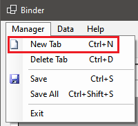
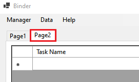
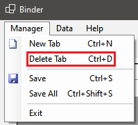
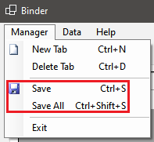
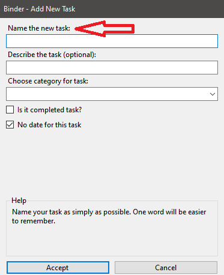
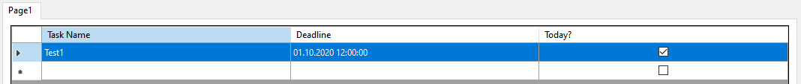

# Dokumentacja użytkownika końcowego Binder

Ostatnia aktualizacja: 05.10.2020 dla wersji 0.1.0

Jeśli wersja programu się zmieniła, a dokumentacja nie została zmieniona, oznacza to, że zmiany w programie nie wymagają aktualizacji dokumentacji.

## Rozpoczynanie pracy z programem

1. Pobierz najnowszą stabilną wersję z repozytorium na GitHub: [Releases · Binder · GitHub](https://github.com/StraykerPL/Binder/releases). Upewnij się, że pobierasz odpowiednią paczkę dla swojego systemu,

2. Rozpakuj program na ogólnodostępnej partycji komputera,

3. Utwórz skrót do pliku wykonywalnego na pulpicie, w zależności od wybranej paczki "Binder.exe" lub "Binder",

4. Uruchom program poprzez skrót i upewnij się, że pojawi się interfejs programu,

## Obsługa programu

1. Jak dodać nową zakładkę z tabelą do programu?
   
   Przy pomocy menu "Manager" kliknij "New Tab":
   
   
   
   Tak jak na zamieszczonym obrazku widneje, można też użyć skrótu CTRL+N.
   
   Binder poprosi Cię o podanie nazwy dla nowej zakładki:
   
   
   
   Po podaniu nazwy i zaakceptowaniu formularza, nowa zakładka pojawi się w interfejsie:
   
   

2. Jak usunąć zakładkę z programu?
   
   Zaznacz w interfejsie zakładkę, którą chcesz usunąć.
   
   Przy pomocy menu "Manager" kliknij "Delete Tab":
   
   
   
   Tak jak na zamieszczonym obrazku widneje, można też użyć skrótu CTRL+D.
   
   *Uwaga: ta operacja usuwa także bazę danych dla danej tabeli! Oznacza to, że jeśli są jakieś dane w tej zakładce, zostaną usunięte.*

3. Jak zapisywać dane szybko i efektywnie?
   
   Menu "Manager" pozwala na dwa typy zapisu: zapis aktywnej zakładki i zapis wszystkich zakładek w programie, odpowiednio "Save" oraz "Save All":
   
   
   
   Użycie pierwszej opcji zapisze aktualnie wybraną zakładkę, druga zapisze wszystkie zakładki w interfejsie. Można użyć także pokazanych skrótów. 

4. Jak dodać zadanie do tabeli?
   
   W menu "Data" opcja "Add Task" dodaje nowe zadanie do tabeli aktywnej zakładki. Opcja otwiera okno dialogowe do podania danych. Po akceptacji zadanie pojawia się w tabeli zakładki. Można użyć także pokazanych skrótów.
   
   
   
   
   
   

5. Jak edytować istniejące zadanie?
   
   W menu "Data" opcja "Edit Task" pozwala na edycję zadań. Opcja otworzy okno dialogowe dla aktualnie zaznaczonego zadania w aktywnej tabeli z zakładki, wczyta dane zadania i pozwoli zmienić informacje. Można użyć także pokazanych skrótów.
   
   
   
   
   
   
   
   

6. Jak usunąć zadanie z tabeli?
   
   W menu "Data" opcja "Delete Task" pozwala na usunięcie niechcianego zadania. Opcja usunie z tabeli aktualnie wybrane zadanie. Można użyć także pokazanych skrótów.
   
   
   
   

## Aktualizacje programu

W najbliższym czasie aktualizacja programu będzie wymagała ręcznego pobierania plików z [Releases · Binder · GitHub](https://github.com/StraykerPL/Binder/releases).
